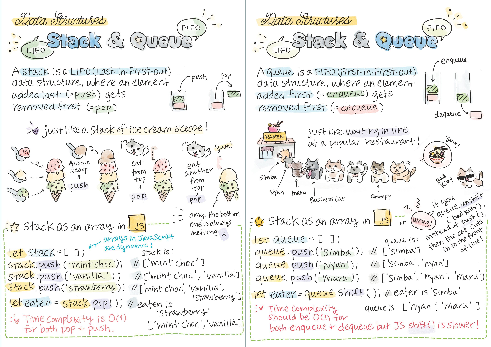

# Stacks, Queues, Sorting & Filtering

Whilst by now we've been using arrays and dynamic arrays (slices in Go), we haven't needed to sort or filter them much, and we haven't really looked at their uses outside of "just holding a collection of things".

You probably don't think of how Ctrl-Z works for "undoing" your last action - it just does. Stacks are used in implementing undo mechanisms in applications. Each action performed by the user is pushed onto a stack, allowing the user to undo actions in reverse order.

You probably don't think too much about how web traffic is handled, but that's a type of queue. In web servers and network protocols, queues are used to manage incoming requests and ensure they are processed in the order they were received.

Here's a great overview from `@girlie_mac` on the differences between stacks and queues, using JavaScript:



## Stacks

A stack is a data structure that follows the *Last In, First Out* (LIFO) principle. 

Imagine it like a stack of plates in a restaurant - the last plate you put on the stack is the first one you pick up. Stacks are used in many programming scenarios, like managing function calls, parsing expressions, and undo mechanisms.

The primary things you can do with a stack is put an item onto the stack (a plate), or remove an item from the top of the stack.

These are generally referred to as *push* (add to stack) and *pop* (remove from top of stack). Many languages have these methods available on the data type, but in Go you often have to roll your own...

In Go, you can implement a stack using a slice.

```go
package main

import (
    "fmt"
)

type Stack []int

func (s *Stack) Push(item int) {
    *s = append(*s, item)
}

func (s *Stack) Pop() int {
    if len(*s) == 0 {
        return -1 // or handle error
    }
    item := (*s)[len(*s)-1]
    *s = (*s)[:len(*s)-1]
    return item
}

func main() {
    var s Stack
    s.Push(1)
    s.Push(2)
    s.Push(3)
    
    fmt.Println(s.Pop()) // Output: 3
    fmt.Println(s.Pop()) // Output: 2
}

```

### A Note On Reslicing

Some of the code looks *weird* in the `Pop` method. But let's explain it a bit more. We'll assume the first `if` statement is understandable - it's basically a guard clause to make sure you can't remove an element from an empty slice.

First up this line gets the last element of the slice and assigns it to the `item` variable:

```go
item := (*s)[len(*s)-1]

```

In this line, `(*s)` dereferences the pointer to the stack `(s)` to access the underlying slice. Then `len(*s)` calculates the length of the slice, and `len(*s)-1` calculates the index of the last element in the slice.

Next, we want to update the slice so it no longer contains the item:

```go
*s = (*s)[:len(*s)-1]

```

This creates a new slice that includes all elements of `*s` ***except*** for the last one. By assigning this new slice back to *s, we effectively modify the original slice, effectively "reslicing" it to exclude the last element.


## Queues

A queue is a data structure that follows the *First In, First Out* (FIFO) principle. It's like a queue at the pub - the first person who enters the queue is the first one to get served. Queues are used in applications like scheduling tasks, handling requests, and breadth-first search algorithms.

For queues, we use the terms *enqueue* when we add something to the queue, and *dequeue* when we remove something from it.

```go
package main

import (
    "fmt"
)

type Queue []int

func (q *Queue) Enqueue(item int) {
    *q = append(*q, item)
}

func (q *Queue) Dequeue() int {
    if len(*q) == 0 {
        return -1 // or handle error
    }
    item := (*q)[0]
    *q = (*q)[1:]
    return item
}

func main() {
    var q Queue
    q.Enqueue(1)
    q.Enqueue(2)
    q.Enqueue(3)
    
    fmt.Println(q.Dequeue()) // Output: 1
    fmt.Println(q.Dequeue()) // Output: 2
}

```

You'll see here when we reslice the array, we do it differently to when we use a stack. That's because we want the *first* item that went into the queue (remember FIFO?):

```go
    item := (*q)[0]
    *q = (*q)[1:]
```

We get the first item in the slice, which is always position zero. We then reslice it using `(*q)[1:]` which creates a new slice from index 1 up to and including the last element in the slice.

## Sorting & Filtering

*Sorting* involves arranging data in a particular order, such as numerical or alphabetical. 

*Filtering* is the process of selecting specific elements from a dataset based on certain criteria.

In Go, you can use built-in functions or libraries for sorting use the built-in `sort` package.

Whilst many other languages have builtin filter functions, in Go you must again roll your own. Filters are simply `for` loops with conditional logic (an `if` statement).

Here's an example of using the `sort` package, and a simple `for` loop that filters only the even numbers into a new slice:

```go
package main

import (
    "fmt"
    "sort"
)

func main() {
    numbers := []int{5, 2, 7, 3, 1, 8, 6, 4}

    // Sorting numbers in ascending order
    sort.Ints(numbers)
    fmt.Println("Sorted numbers:", numbers)

    // Filtering out odd numbers
    var filteredNumbers []int
    for _, num := range numbers {
        if num%2 == 0 { // Check if the number is even
            filteredNumbers = append(filteredNumbers, num)
        }
    }
    fmt.Println("Filtered even numbers:", filteredNumbers)
}

```

### Sorting Examples

#### Sort a slice of strings
The `sort.Strings` method sorts a slice of strings in increasing order as shown below:

```go
func main() {
	s := []string{"James", "John", "Peter", "Andrew", "Matthew", "Luke"}
	sort.Strings(s)
	fmt.Println(s) // [Andrew James John Luke Matthew Peter]
}
```
The `sort.StringsAreSorted` method also exists to help you check if a string slice is in its sorted form (that is, in increasing order):

```go
func main() {
	s := []string{"James", "John", "Peter", "Andrew", "Matthew", "Luke"}
	fmt.Println(sort.StringsAreSorted(s)) // false
	sort.Strings(s)
	fmt.Println(sort.StringsAreSorted(s)) // true
}
```

#### Sort a slice of integers
To sort a slice of integers, use the `sort.Ints` method as shown below:
```go
func main() {
	intSlice := []int{4, 5, 2, 1, 3, 9, 7, 8, 6}
	fmt.Println(sort.IntsAreSorted(intSlice)) // false
	sort.Ints(intSlice)
	fmt.Println(intSlice) // [1 2 3 4 5 6 7 8 9]
	fmt.Println(sort.IntsAreSorted(intSlice)) // true
}
```

#### Sort a slice of floats
A slice of float64s may be sorted in increasing order using sort.Float64s:

```go
func main() {
	f := []float64{math.NaN(), -0.2, -1.3, 0.9, 4.8, 2.1}
	fmt.Println(sort.Float64sAreSorted(f)) // false
	sort.Float64s(f)
	fmt.Println(f) // [NaN -1.3 -0.2 0.9 2.1 4.8]
	fmt.Println(sort.Float64sAreSorted(f)) // true
}
```

#### Sort a slice of structs
To sort a slice of structs in Go, you need to use a less function along with either the `sort.Slice` or `sort.SliceStable` methods. Here’s how we can sort a slice of persons according to their names and ages for example:

```go
type Person struct {
	name string
	age  int
}

func main() {
	people := []Person{{"Sally", 20}, {"David", 40}, {"Jon", 30}, {"Larry", 25}}
	sort.SliceStable(people, func(i, j int) bool {
		return people[i].age < people[j].age
	})

	fmt.Println("Sorted by age:", people)

	sort.SliceStable(people, func(i, j int) bool {
		return people[i].name < people[j].name
	})

	fmt.Println("Sorted by name:", people)
}
```

```
output
Sorted by age: [{Sally 20} {Larry 25} {Jon 30} {David 40}]
Sorted by name: [{David 40} {Jon 30} {Larry 25} {Sally 20}]
```

Returning true from the less function will cause the element at index i to be sorted to a lower position than index j (The element at index i will come first in the sorted slice). Otherwise, the element at index j will come first if false is returned.

The difference between `sort.Slice` and `sort.SliceStable` is that the latter will keep the original order of equal elements while the former may not.

#### Sort a struct slice using multiple keys
In the example below, a slice of Person structs is sorted by LastName, and then by FirstName so that if two people have the same LastName, they’ll be ordered according to their FirstName.

```go
type Person struct {
	FirstName string
	LastName  string
}

func main() {
	people := []Person{
		{"Michael", "Jackson"},
		{"Janet", "Jackson"},
		{"Keanu", "Reeves"},
		{"Reverend", "King"},
		{"Jane", "Austen"},
	}

	sort.SliceStable(people, func(i, j int) bool {
		if people[i].LastName != people[j].LastName {
			return people[i].LastName < people[j].LastName
		}

		return people[i].FirstName < people[j].FirstName
	})

	fmt.Println(people)
}
```

Notice how Janet Jackson comes before Michael Jackson in the output.

```
output
[{Jane Austen} {Janet Jackson} {Michael Jackson} {Reverend King} {Keanu Reeves}]
```